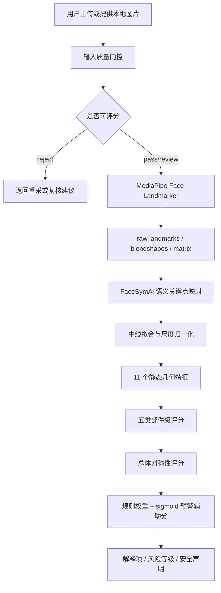

# FaceSymAi V1 能力记录与分析

版本日期：2026-05-22  
适用范围：当前项目中已跑通的 V1 静态图片人脸对称性分析能力  
能力状态：可运行技术 baseline，尚未完成医学诊断级验证  

## 0. 结论摘要

FaceSymAi 当前已形成一条可复现的静态图片人脸对称性分析链路：对 `front`、`smile`、`teeth` 三类静态人脸图片执行输入质量门控，调用 MediaPipe Tasks `Face Landmarker` 生成 478 个 raw landmarks、52 个 blendshape 分数和 facial transformation matrix，再将关键点映射到 FaceSymAi 语义点，计算人脸总体对称性、口部、眼部、眉部、鼻面中线和面部轮廓五类属性，并输出脑卒中/面瘫预警辅助解释。

当前评估结果来自 `datasets/facesym_v1_by_name_20260119`，覆盖 505 个患者、1546 张 V1 图片。规则 baseline 在 test split 上的 precision 为 `0.662338`，TP=51，FP=26。该指标基于 patient outcome 标签（`患病`/`不患病`），不是人工面部不对称 ground truth，也不是医学诊断准确率。

## 1. 能力名称

**静态图片人脸对称性分析与脑卒中/面瘫预警辅助解释能力**

项目内对应名称：

- FaceSymAi V1
- V1 static-image facial symmetry analysis
- MediaPipe Face Landmarker + 关键点几何规则 baseline

## 2. 能力描述

本能力从本地静态人脸图片中提取面部关键点和几何特征，判断面部左右对称性，并给出可解释的预警辅助结果。

当前能力边界：

- 支持 V1 静态图片，优先处理 `front`、`smile`、`teeth`。
- 输出总体对称性评分、异常严重度、疑似异常侧、五类部件级属性、质量提示、主要异常贡献项和预警辅助置信度。
- 结果定位为脑卒中/面瘫相关的风险提示和解释增强。
- 不输出“确诊脑卒中”“确诊面瘫”等医学诊断结论。
- 不覆盖 V2 动态视频动作分析、语音/肢体多模态融合、临床概率校准或外部临床验证。

## 3. 输入

### 3.1 用户级输入

| 输入项 | 当前要求 |
| --- | --- |
| 图片类型 | 静态图片 |
| 推荐图片角色 | 正脸静息图 `front`、微笑图 `smile`、示齿图 `teeth` |
| 文件格式 | `jpg`、`jpeg`、`png`、`webp`、`bmp`、`tif`、`tiff` |
| 人脸要求 | 单人脸、正脸、无遮挡、光照均匀、清晰 |
| 图片尺寸 | 短边不低于 256 px，推荐更高分辨率 |
| 姿态要求 | 推荐 yaw/pitch/roll 接近正脸，过大姿态会降低可信度或触发重采 |

### 3.2 当前数据集输入

当前正式 V1 流程输入：

```text
datasets/stroke_patient_outcome_by_name_20260119
```

运行角色：

```text
front,smile,teeth
```

当前输入规模：

| 指标 | 数值 |
| --- | ---: |
| 患者数 | 505 |
| 图片数 | 1546 |
| 患病患者 | 336 |
| 不患病患者 | 169 |
| `front` 图片 | 516 |
| `smile` 图片 | 513 |
| `teeth` 图片 | 517 |

标签口径：

- 当前使用 patient outcome 标签：`患病` / `不患病`。
- 该标签不是人工标注的面部不对称标签。
- 因此当前评估只能作为技术信号检查，不能作为临床诊断性能结论。

## 4. 输出

### 4.1 图片级输出

每张图片可输出：

| 输出 | 说明 |
| --- | --- |
| `status` | `detected`、`no_face`、`multiple_faces`、`failed` |
| `raw_landmarks` | MediaPipe 原始归一化人脸关键点，当前成功样本为 478 个 |
| `landmarks` | FaceSymAi 语义关键点，如鼻梁、鼻尖、下巴、眼角、眉部、口角、脸颊、下颌 |
| `blendshapes` | MediaPipe 表情 blendshape 分数，当前成功样本为 52 个 |
| `facial_transformation_matrixes` | MediaPipe facial transformation matrix |
| `overall_symmetry_score` | 总体对称性评分，0 到 100，越高越对称 |
| `overall_asymmetry_severity` | 总体异常严重度，0 到 1，越高越异常 |
| `affected_side` | 疑似异常侧：`left`、`right`、`bilateral`、`uncertain` |
| `attributes` | 口部、眼部、眉部、鼻面中线、面部轮廓五类部件属性 |
| `advisory_confidence` | 当前规则 baseline 的预警辅助置信度，0 到 1 |
| `risk_level` | `low`、`watch`、`elevated`、`high` |
| `top_contributions` | 贡献最大的异常特征 |
| `warnings` | 输入质量和使用限制提示 |
| `disclaimer` | 医疗安全声明 |

### 4.2 当前项目产物

正式 V1 输出目录：

```text
datasets/facesym_v1_by_name_20260119
```

核心产物：

| 阶段 | 产物 |
| --- | --- |
| `01_manifest` | `metadata/01_manifest.csv`、`reports/01_manifest.md` |
| `02_quality_gate` | `metadata/02_quality_gate.csv`、`metadata/02_quarantined_images.csv`、`reports/02_quality_gate.md` |
| `03_keypoints` | `metadata/03_keypoints.csv`、`keypoints/.../*.json`、`annotated/.../*.jpg`、`reports/03_keypoints.md` |
| `04_features` | `metadata/04_image_features.csv`、`metadata/04_patient_features.csv`、`reports/04_features.md` |
| `05_patient_splits` | `metadata/05_patient_splits.csv`、`reports/05_patient_splits.md` |
| `06_baseline_evaluation` | `metadata/06_baseline_predictions.csv`、`metadata/06_baseline_evaluation.json`、`reports/06_baseline_evaluation.md` |

可视化图片输出：

```text
datasets/facesym_v1_by_name_20260119/annotated/.../*.jpg
```

这些图片在源图上叠加 landmark，可用于人工抽样检查关键点是否落在人脸结构上。

## 5. 技术原理

### 5.1 系统总体流程



### 5.2 系统内部步骤

1. **输入筛选**
   从源数据集中筛选 V1 目标角色：`front`、`smile`、`teeth`。

2. **质量门控**
   检查文件可读性、格式、图片尺寸、人脸数量、人脸大小、清晰度、光照、曝光、左右光照差、遮挡代理和示齿合规代理。当前质量等级为 `pass`、`review`、`reject`。

3. **人脸关键点检测**
   使用 MediaPipe Tasks `Face Landmarker`，当前模型文件：

   ```text
   models/mediapipe/face_landmarker.task
   ```

   成功检测时输出 478 个 raw landmarks、52 个 blendshape 分数和 1 或 2 个 transformation matrix。

4. **语义关键点映射**
   将 MediaPipe index 映射为业务可理解的语义点，包括 `nose_bridge`、`nose_tip`、`chin`、左右眼角、左右眉头眉尾、左右口角、上下唇中点、左右鼻翼、脸颊和下颌。

5. **坐标标准化**
   用 `nose_bridge`、`nose_tip`、`chin` 拟合鼻面中线。将所有关键点投影到以该中线为纵轴的局部坐标系，并使用双眼外角距离做尺度归一化。

   关键公式：

   ```text
   x' = signed_distance(point, midline) / eye_outer_distance
   y' = project_along_midline(point, midline) / eye_outer_distance
   ```

   标准化后，轻微 roll、拍摄距离和图片尺寸差异对特征的影响会降低。

6. **静态几何特征提取**
   当前 V1 使用 11 个特征：

   - `global_mirror_error`
   - `midline_deviation`
   - `mouth_corner_vertical_asymmetry`
   - `mouth_width_asymmetry`
   - `lip_midline_deviation`
   - `eye_aperture_asymmetry`
   - `eye_corner_height_asymmetry`
   - `brow_vertical_asymmetry`
   - `brow_outer_vertical_asymmetry`
   - `contour_mirror_error`
   - `jaw_width_asymmetry`

7. **严重度映射**
   每个特征值按软阈值映射为 0 到 1 的严重度：

   ```text
   severity = clamp((value - low) / (high - low), 0, 1)
   ```

8. **部件级聚合**
   将特征聚合为五类部件属性：

   | 部件 | 主要含义 |
   | --- | --- |
   | `mouth` | 嘴角下垂、口角宽度差、唇中线偏移 |
   | `eye` | 眼裂开合差、眼角高度差 |
   | `brow` | 眉头和眉尾高度差 |
   | `midline` | 鼻面中线和唇中线偏移 |
   | `contour` | 脸颊和下颌轮廓镜像误差 |

9. **总体对称性评分**
   当前总体异常严重度权重：

   ```text
   overall_asymmetry_severity =
     0.30 * mouth_score
     + 0.20 * severity(global_mirror_error)
     + 0.18 * midline_score
     + 0.12 * eye_score
     + 0.10 * brow_score
     + 0.10 * contour_score
   ```

   总体对称性评分：

   ```text
   overall_symmetry_score = 100 * (1 - overall_asymmetry_severity)
   ```

10. **预警辅助分**
    当前使用规则权重 baseline：

    ```text
    logit = -2.2 + sum(feature_weight_i * severity_i)
    raw_score = sigmoid(logit)
    advisory_confidence = clamp(raw_score * input_quality, 0, 1)
    ```

    风险等级：

    | 条件 | 风险等级 |
    | --- | --- |
    | `advisory_confidence >= 0.75` | `high` |
    | `advisory_confidence >= 0.50` | `elevated` |
    | `advisory_confidence >= 0.25` | `watch` |
    | 其他 | `low` |

11. **患者级聚合**
    对每个患者的 `front`、`smile`、`teeth` 图片取最高 `advisory_confidence` 作为当前 baseline 的患者级分数。

12. **阈值与评估**
    在 validation split 上选择阈值，当前阈值为 `0.277158`。test split 上按该阈值计算 precision、recall、specificity、F1 和混淆矩阵。

## 6. 科学依据

### 6.1 工程与计算机视觉依据

| 依据 | 与本项目关系 |
| --- | --- |
| Google AI Edge MediaPipe Face Landmarker 官方文档 | Face Landmarker 支持静态图、视频帧和实时流，输出 3D face landmarks、blendshape scores 和 facial transformation matrices。本项目检测层采用该任务。 |
| Lugaresi et al., 2019, *MediaPipe: A Framework for Building Perception Pipelines* | 支撑 MediaPipe 作为跨平台感知管线框架的工程依据。 |
| Kartynnik et al., 2019, *Real-time Facial Surface Geometry from Monocular Video on Mobile GPUs* | 支撑单目 RGB 输入估计密集 3D 人脸网格的技术依据；该论文描述的 face mesh 思路与本项目关键点几何分析相关。 |

### 6.2 医学与量表依据

| 依据 | 与本项目关系 |
| --- | --- |
| CDC Stroke Signs and Symptoms | CDC 将突发单侧面部、手臂或腿部麻木/无力列为卒中症状之一，并在 B.E. F.A.S.T. 中包含 Face droop 检查。本项目只使用面部对称性作为预警辅助解释。 |
| NINDS NIH Stroke Scale | NIHSS 是卒中严重程度评估工具，包含 Facial Palsy 项。本项目的面部对称性输出可作为面部异常的视觉解释参考，但不等同于 NIHSS 评分。 |
| Brott et al., 1989, *Stroke* | NIHSS 相关临床检查量表的重要文献依据，说明卒中评估中存在标准化神经功能检查框架。 |
| House & Brackmann, 1985, *Otolaryngology-Head and Neck Surgery* | House-Brackmann Facial Nerve Grading System 是面神经功能分级参考。本项目当前未输出正式 House-Brackmann 等级，仅将口眼眉等区域对称性作为解释属性。 |

### 6.3 项目内依据

项目内已形成以下技术文档和产物：

- `docs/algorithm/facesym-v1-calculation-technical-document.md`
- `docs/algorithm/facial-symmetry-analysis.md`
- `docs/algorithm/facial-symmetry-technical-solution.md`
- `docs/algorithm/evaluation-protocol.md`
- `docs/datasets/facesym-v1-by-name-data-flow.md`
- `datasets/facesym_v1_by_name_20260119/metadata/*`
- `datasets/facesym_v1_by_name_20260119/reports/*`

### 6.4 专利、资质和合规状态

当前项目目录中未发现以下材料：

- FaceSymAi 自有专利文件或专利申请号。
- 医疗器械注册证、NMPA/FDA/CE 等监管资质文件。
- 临床试验批件、伦理批件或多中心临床验证报告。
- MediaPipe 模型 checksum、模型卡和内部审批记录。

因此当前文档不得声称该能力已经取得医疗诊断资质、监管认证或专利授权。现阶段只能表述为研发中的预警辅助和技术验证能力。

## 7. 能力验证过程

### 7.1 如何测评和验证

当前验证由四层组成：

1. **单元测试**
   项目上下文记录当前测试通过：`25 passed`。覆盖关键点 schema、几何特征、质量门控、输入管理、数据集处理和 MediaPipe adapter。

2. **单图 smoke test**
   使用 `scripts/detect_mediapipe_image.py` 对本地图片执行 Face Landmarker 检测，验证输出 `status=detected`、478 个 raw landmarks、52 个 blendshape 和 transformation matrix，并可联动对称性分析。

3. **批量数据流程验证**
   使用当前正式脚本：

   ```bash
   scripts/run_in_project_env.sh python scripts/build_facesym_v1_dataset_from_by_name.py \
     --output datasets/facesym_v1_by_name_20260119 \
     --roles front,smile,teeth
   ```

   验证 6 个阶段均可生成 CSV、JSON、Markdown 报告和 landmark overlay 图片。

4. **患者级 baseline 评估**
   按患者维度切分 train/val/test，避免同一患者不同图片跨 split 泄漏。在 validation split 上选择阈值，在 test split 上一次性计算指标。

### 7.2 当前验证数据

| 验证项 | 当前结果 |
| --- | ---: |
| 患者数 | 505 |
| V1 图片数 | 1546 |
| 质量门控 `pass` | 938 |
| 质量门控 `review` | 15 |
| 质量门控 `reject` | 593 |
| accepted_for_scoring | 953 |
| MediaPipe `detected` | 1538 |
| MediaPipe `no_face` | 7 |
| MediaPipe `failed` | 1 |
| landmark overlay 图片 | 1538 |
| feature-ready 图片 | 1538 |
| 患者级特征行 | 505 |

患者级切分：

| split | 患者数 | 患病 | 不患病 |
| --- | ---: | ---: | ---: |
| train | 353 | 235 | 118 |
| val | 75 | 50 | 25 |
| test | 77 | 51 | 26 |

### 7.3 验证周期持续多久

项目内可确认的时间节点：

| 时间 | 事件 |
| --- | --- |
| 2026-05-18 | 当前 BMAD 规划文档创建，路线图开始记录本轮项目推进 |
| 2026-05-20 | PRD 和 implementation roadmap 更新到当前 V1 状态 |
| 2026-05-21 14:34:57 +0800 | `datasets/facesym_v1_by_name_20260119` 的 `pipeline_summary.json` 和 `06_baseline_evaluation.json` 生成 |
| 2026-05-21 15:03:16 +0800 | V1 计算技术文档生成 |
| 2026-05-22 | 本能力记录文档生成 |

因此，当前可复核的第一轮技术闭环从 2026-05-18 到 2026-05-21，约 4 个自然日。原技术方案中的 V1 计划周期是“两个月内完成”。单次全量 pipeline 的 wall-clock 运行耗时未在当前产物中记录，如需正式验收，应后续用 `time` 或独立运行日志记录。

## 8. 操作步骤

### 8.1 用户单图分析步骤

1. 准备清晰、正脸、无遮挡的人脸图片，推荐包含静息正脸、微笑或示齿图。
2. 进入项目目录并使用项目运行环境。
3. 执行单图检测与分析：

   ```bash
   scripts/run_in_project_env.sh python scripts/detect_mediapipe_image.py \
     path/to/local-image.jpg \
     --output tmp/facesymai-mediapipe-result.json \
     --annotated-output tmp/mediapipe_annotated \
     --pretty \
     --include-analysis
   ```

4. 查看 JSON 输出中的 `status`、`symmetry`、`attributes`、`advisory_confidence`、`risk_level`、`top_contributions` 和 `warnings`。
5. 查看 `tmp/mediapipe_annotated` 下的 landmark overlay 图片，确认关键点是否正确落在人脸上。
6. 若结果为 `review`、`reject` 或 warning 较多，应重新采集更清晰、无遮挡、光照稳定的图片。
7. 如出现突发面瘫、肢体无力、言语异常、意识改变等症状，应按急救和临床流程处理，不能依赖本系统结果排除风险。

### 8.2 用户批量数据集评估步骤

1. 准备按患者组织的数据集和标签字段。
2. 确认要纳入的图片角色，当前推荐 `front,smile,teeth`。
3. 运行正式 V1 数据流程：

   ```bash
   scripts/run_in_project_env.sh python scripts/build_facesym_v1_dataset_from_by_name.py \
     --output datasets/facesym_v1_by_name_20260119 \
     --roles front,smile,teeth
   ```

4. 复核阶段报告：

   ```text
   datasets/facesym_v1_by_name_20260119/reports/*.md
   ```

5. 抽样复核 landmark overlay：

   ```text
   datasets/facesym_v1_by_name_20260119/annotated/.../*.jpg
   ```

6. 查看样本级预测明细：

   ```text
   datasets/facesym_v1_by_name_20260119/metadata/06_baseline_predictions.csv
   ```

7. 查看评估 JSON：

   ```text
   datasets/facesym_v1_by_name_20260119/metadata/06_baseline_evaluation.json
   ```

8. 正式验收前，必须冻结测试集、阈值、阳性规则和标签口径。

## 9. 时间

### 9.1 当前项目周期

| 类型 | 当前记录 |
| --- | --- |
| V1 计划周期 | 技术方案记录为两个月内完成 |
| 当前第一轮技术闭环 | 2026-05-18 到 2026-05-21，约 4 个自然日 |
| 当前能力文档日期 | 2026-05-22 |
| 当前输入数据版本 | `stroke_patient_outcome_by_name_20260119` |
| 当前输出数据版本 | `facesym_v1_by_name_20260119` |
| 当前线上 App 相关输入文件 | `脑卒中预警报告老来健康app线上_2026-05-08.xlsx`，未作为本 V1 by-name 正式评估输入 |

### 9.2 单次运行耗时

当前项目产物没有记录单次全量 pipeline 的 wall-clock 耗时。已知全量流程完成了 1546 张 V1 图片的质量门控、MediaPipe 检测、关键点绘制、特征生成、患者级切分和 baseline 评估。若需要提交验收材料，建议在下一次复跑时记录：

```bash
time scripts/run_in_project_env.sh python scripts/build_facesym_v1_dataset_from_by_name.py \
  --output datasets/facesym_v1_by_name_20260119 \
  --roles front,smile,teeth
```

并在报告中同时记录机器配置、CPU/GPU、MediaPipe 版本、模型 checksum、输入图片数量和失败数量。

## 10. 准确度

### 10.1 当前 test split 指标

当前 baseline：

```text
baseline = max role advisory_confidence threshold
threshold = 0.277158
threshold_source = validation split
positive_rule = patient_score >= threshold
test_set = datasets/facesym_v1_by_name_20260119 / test split
label = patient outcome, 患病 / 不患病
```

test split 混淆矩阵：

| 指标 | 数值 |
| --- | ---: |
| test patients | 77 |
| evaluated | 77 |
| TP | 51 |
| FP | 26 |
| TN | 0 |
| FN | 0 |

当前指标：

| 指标 | 公式 | 数值 |
| --- | --- | ---: |
| precision | `TP / (TP + FP)` | 0.662338 |
| recall | `TP / (TP + FN)` | 1.000000 |
| specificity | `TN / (TN + FP)` | 0.000000 |
| F1 | `2 * precision * recall / (precision + recall)` | 0.796875 |
| conventional accuracy | `(TP + TN) / total` | 0.662338 |
| balanced accuracy | `(recall + specificity) / 2` | 0.500000 |

precision 计算：

```text
precision = 51 / (51 + 26)
          = 51 / 77
          = 0.6623376623376623
          ~= 0.662338
```

### 10.2 指标解释限制

当前 test split 中 77 个患者全部被预测为阳性，因此 `TN=0`、`FN=0`，specificity 为 0。此时 conventional accuracy 与 precision 都等于测试集阳性占比 `51/77`。

这说明当前规则 baseline 已经跑通检测、特征、聚合、阈值和评估链路，但它还没有证明对阴性样本有有效排除能力。当前准确度不得描述为临床诊断准确率，也不能直接用于“精准检测脑卒中”的对外宣传。

正式能力验收前需要补齐：

- 冻结测试集版本。
- 人工面部不对称或面瘫标签，或明确 patient outcome 作为标签的业务合理性。
- 阈值审批记录。
- 样本级 TP/FP/TN/FN 复核。
- 外部测试集或前瞻性验证。
- 置信区间、分层指标、误报和漏报分析。

## 11. 参考资料

项目内资料：

- `docs/algorithm/facesym-v1-calculation-technical-document.md`
- `docs/algorithm/evaluation-protocol.md`
- `docs/algorithm/mediapipe-local-image-runtime.md`
- `docs/datasets/facesym-v1-by-name-data-flow.md`
- `_bmad-output/planning-artifacts/prd.md`
- `_bmad-output/planning-artifacts/implementation-roadmap.md`

外部资料：

- Google AI Edge, MediaPipe Face Landmarker: https://ai.google.dev/edge/mediapipe/solutions/vision/face_landmarker
- Lugaresi et al., 2019, *MediaPipe: A Framework for Building Perception Pipelines*: https://arxiv.org/abs/1906.08172
- Kartynnik et al., 2019, *Real-time Facial Surface Geometry from Monocular Video on Mobile GPUs*: https://arxiv.org/abs/1907.06724
- CDC, Signs and Symptoms of Stroke: https://www.cdc.gov/stroke/signs-symptoms/
- NINDS, NIH Stroke Scale: https://www.ninds.nih.gov/health-information/stroke/assess-and-treat/nih-stroke-scale
- NINDS NIH Stroke Scale PDF: https://www.ninds.nih.gov/sites/default/files/documents/NIH-Stroke-Scale_updatedFeb2024_508.pdf
- Brott et al., 1989, *Measurements of acute cerebral infarction: a clinical examination scale*: https://pubmed.ncbi.nlm.nih.gov/2749846/
- House & Brackmann, 1985, *Facial nerve grading system*: https://pubmed.ncbi.nlm.nih.gov/3921901/
