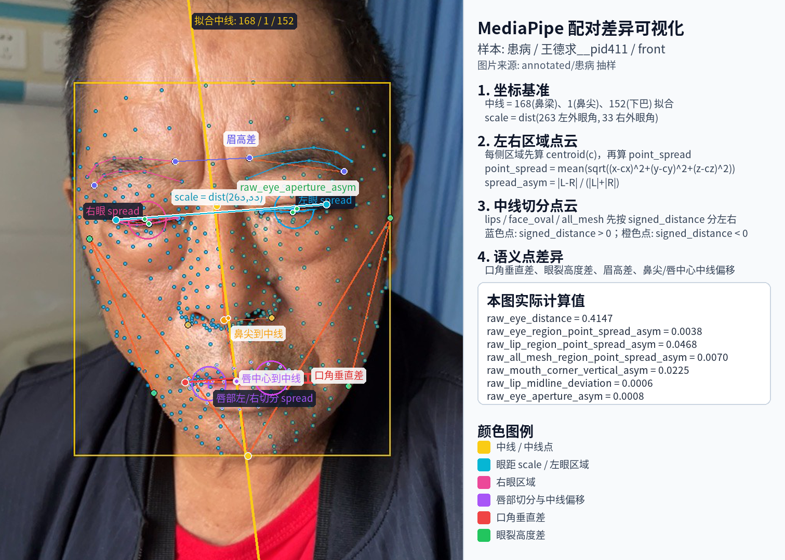
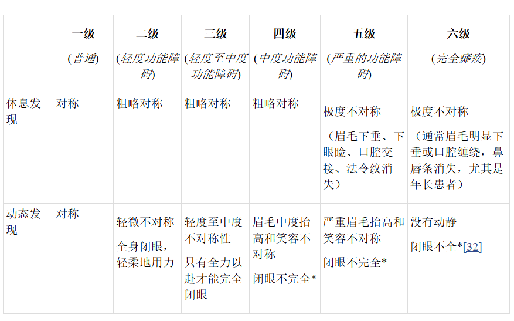

# MediaPipe 输出到配对差异与特征差异的处理说明

本文记录当前 FaceSymAi 项目如何使用 MediaPipe Face Landmarker 的输出完成两类分析：

- **特征差异**：从 MediaPipe 单图输出生成 `raw_*`、`bsdiff_*`、`bs_*` 等可比较特征，再按 HB proxy grade I-VI 统计等级差异。
- **配对差异**：固定一组病例，再按 split、grade 和代理分数接近度挑选对照病例，比较患者级组件、role 驱动、top features 和关键点叠加图。

文档对应当前数据集：

```text
datasets/facesym_v1_all_images_no_gate_20260119
```

核心产物：

```text
metadata/09_mediapipe_full_features.csv
metadata/12_v11_hb_proxy_mediapipe_grade_differences.csv
metadata/14_v11_hb_proxy_grade_v_plus_18_pair_comparison.csv
reports/16_v11_grade_v_plus_18_disease_nondisease_comparison.md
```

## 1. MediaPipe 原始输出

MediaPipe Face Landmarker 对每张检测成功的人脸图输出三类结构：

| 输出 | 当前项目处理方式 | 作用 |
| --- | --- | --- |
| `raw_landmarks` | 478 个归一化 3D 点，保留原始 index `0..477`，每个点包含 `x/y/z/confidence` | 生成静态几何、左右区域和全脸点云不对称特征 |
| `blendshapes` | 52 个表情系数 | 生成原始表情强度 `bs_*` 和左右表情差 `bsdiff_*` |
| `facial_transformation_matrixes` / `pose` | 提取平移、尺度、姿态角等 | 作为姿态、采集距离和质量控制变量，不作为主不对称证据 |

读取位置：

```text
src/facesymai/landmarks/mediapipe_face_landmarker.py
scripts/analyze_v1_mediapipe_full_feature_differences.py
```

每张图片进入特征提取前必须满足：

```text
detection_status = detected
len(raw_landmarks) >= 478
```

原因：后续区域点集和全脸点云统计依赖固定 MediaPipe index，关键点数量不足时无法保证 index 语义稳定。

当前项目实际保存的单个 raw landmark 形态如下：

```json
{
  "x": 0.47274067997932434,
  "y": 0.4839596152305603,
  "z": -0.1348445862531662,
  "confidence": 1.0
}
```

其中：

- `x` 是图像横向归一化坐标，通常在 `0..1`，左边界接近 `0`，右边界接近 `1`。
- `y` 是图像纵向归一化坐标，通常在 `0..1`，上边界接近 `0`，下边界接近 `1`。
- `z` 是 MediaPipe 模型估计的相对深度/归一化深度，不是毫米、厘米等真实物理距离。
- `confidence` 当前统一写为 `1.0`，表示检测结果已通过 Face Landmarker 返回；它不是逐点置信度校准值。

因此，MediaPipe 输出不是纯 2D 点。FaceSymAi 在计算距离、区域离散度时会读取 `z`，但在主证据筛选时会谨慎处理深度相关字段：`*_centroid_z_asym`、`matrix_*`、`pose_*`、`distance/scale/bbox` 等不进入 HB proxy 等级差异主证据。

## 2. 478 个 raw landmarks 如何处理

### 2.1 坐标与尺度标准化

MediaPipe `raw_landmarks` 到 FaceSymAi 特征之间有两层归一化，必须分开理解。

第一层是 MediaPipe 自身输出的图像坐标归一化：

```text
point[i] = (x_i, y_i, z_i), i = 0..477
```

其中 `x_i/y_i` 是相对于整张图片宽高的归一化坐标。如果需要把关键点画回图片，项目只使用 `x/y` 转像素：

```text
pixel_x = clamp(x_i, 0, 1) * (image_width  - 1)
pixel_y = clamp(y_i, 0, 1) * (image_height - 1)
```

这个转换只用于可视化。它说明 `x/y` 和图片像素的关系，但后续算法计算仍直接使用 MediaPipe 输出的归一化浮点坐标，而不是转成像素后再算。

第二层是 FaceSymAi 的人脸尺度归一化。项目先计算左右外眼角之间的 3D 距离：
这里的 dist 是 3D 欧氏距离：sqrt((x1-x2)^2 + (y1-y2)^2 + (z1-z2)^2)

```text
scale = dist(point[263], point[33])
```

点位定义：

```text
263 = left_eye_outer
33  = right_eye_outer
```

其中：

```text
dist(a, b) = sqrt((x_a-x_b)^2 + (y_a-y_b)^2 + (z_a-z_b)^2)
```

也就是说，`scale` 来自 MediaPipe 归一化 3D 坐标空间，不是像素距离。当前样本中的 `raw_eye_distance` 就是这个尺度值。后续几何距离除以 `scale`：

```text
normalized_distance = raw_distance / scale
```

这样做的原因是同一患者和不同患者的拍摄距离、图片裁剪、脸部占比不同。直接使用像素距离或原始归一化坐标距离，会把“人脸离镜头远近”和“图片裁剪比例”混入不对称特征。

示例：

```text
raw_mouth_corner_vertical_asym =
abs(y_291 - y_61) / scale

raw_lip_opening =
dist(point[13], point[14]) / scale

raw_eye_aperture_asym =
abs(dist(point[386], point[374]) - dist(point[159], point[145])) / scale
```

注意：`raw_eye_distance` 本身会保留在 09 阶段特征表中，便于检查采集尺度，但 12 阶段会把包含 `distance` 的字段排除，不把它作为人脸不对称主证据。

### 2.1.1 中线拟合

项目再用三个中线点拟合面部中线：

```text
nose_bridge = 168
nose_tip    = 1
chin        = 152
```

对每个 landmark 计算到中线的有符号距离：

```text
signed_distance[i] = signed_distance_2d(point[i], midline) / scale
```

具体做法是在 `x/y` 平面拟合一条 2D 直线：

```text
midline: a*x + b*y + c = 0
```

然后每个点到中线的有符号距离为：

```text
signed_distance_raw[i] = a*x_i + b*y_i + c
signed_distance[i] = signed_distance_raw[i] / scale
```

这里中线只用 `x/y` 拟合，不用 `z` 拟合。原因是正脸左右划分本质上是图像平面中的左右分区；`z` 更容易受头部前后转动、模型深度估计和采集距离影响。距离再除以 `scale`，是为了让不同人脸大小的中线偏移可比较。

### 2.1.2 左右脸点云生成

左右脸点云有两种来源。

第一种是天然左右成对区域。比如眼、眉、虹膜在 MediaPipe index 中已经有明确左右区域：

```text
left_eye_points  = {249,263,362,373,374,380,381,382,384,385,386,387,388,390,398,466}
right_eye_points = {7,33,133,144,145,153,154,155,157,158,159,160,161,163,173,246}
```

这类区域直接取左侧 index 集合作为 `left_points`，右侧 index 集合作为 `right_points`。

第二种是中线切分区域。比如：

```text
lips
face_oval
all_mesh = 0..477 全部 raw landmarks
```

这些区域不是简单的一一左右成对点集，因此先用上一步得到的 `signed_distance` 切分：

```text
left_points  = {point[i] | signed_distance[i] > 0}
right_points = {point[i] | signed_distance[i] < 0}
```

然后对左右两侧点云分别计算统计量。以 `raw_all_mesh_region_*` 为例，它不是 478 个点逐点镜像配对，而是：

```text
1. 读取 0..477 全部 MediaPipe raw landmarks
2. 用 168/1/152 拟合面部中线
3. 对每个点计算 signed_distance
4. 按 signed_distance 的正负切成两侧点云
5. 分别计算左右点云的 width、height、area、centroid_y、centroid_z、point_spread
6. 输出左右统计量差异
```

这样做的好处是全脸 478 点里并不是每个 index 都有稳定的一一镜像点；点云统计不依赖逐点镜像关系，更适合跨患者、跨表情、跨 role 批量比较。

### 2.2 语义点差异

项目把部分 MediaPipe index 固定映射为 FaceSymAi 语义点：

| 语义点 | MediaPipe index | 生成特征 |
| --- | ---: | --- |
| `left_eye_outer` / `right_eye_outer` | 263 / 33 | `raw_eye_distance`、尺度归一化 |
| `left_eye_upper` / `left_eye_lower` | 386 / 374 | 左眼裂高度 |
| `right_eye_upper` / `right_eye_lower` | 159 / 145 | 右眼裂高度 |
| `left_brow_inner` / `right_brow_inner` | 336 / 107 | `raw_brow_inner_height_asym` |
| `left_brow_outer` / `right_brow_outer` | 276 / 46 | `raw_brow_outer_height_asym` |
| `left_mouth_corner` / `right_mouth_corner` | 291 / 61 | `raw_mouth_corner_vertical_asym`、`raw_mouth_width` |
| `upper_lip_center` / `lower_lip_center` | 13 / 14 | `raw_lip_midline_deviation`、`raw_lip_opening` |
| `left_nostril` / `right_nostril` | 327 / 98 | `raw_nostril_width_asym` |
| `left_cheek` / `right_cheek` | 454 / 234 | `raw_cheek_width_asym` |
| `left_jaw` / `right_jaw` | 365 / 136 | `raw_jaw_width_asym` |

这些特征直接表达局部左右几何差异，适合解释口角、眼裂、眉高、鼻翼、面颊和下颌等可观察不对称。

直接由 FaceSymAi 语义点生成的字段如下：

| 字段 | 使用点位 | 计算含义 | 是否进入 HB proxy 等级差异 |
| --- | --- | --- | --- |
| `raw_eye_distance` | 263、33 | 左右外眼角 3D 距离，作为尺度 `scale` | 否，包含 `distance`，只作为归一化尺度 |
| `raw_mouth_corner_vertical_asym` | 291、61 | 左右口角 y 坐标差的绝对值 / `scale` | 是 |
| `raw_mouth_width` | 291、61 | 左右口角 3D 距离 / `scale` | 是，表达口部动作幅度和口宽变化 |
| `raw_lip_opening` | 13、14 | 上下唇中心 3D 距离 / `scale` | 是，表达张口/示齿动作幅度 |
| `raw_lip_midline_deviation` | 13、14 与中线 168/1/152 | 上下唇中心到中线 signed distance 的平均绝对值 | 是 |
| `raw_nose_tip_midline_deviation` | 1 与中线 168/1/152 | 鼻尖到中线 signed distance 的绝对值 | 是 |
| `raw_nostril_width_asym` | 327、98 与中线 | 左右鼻翼到中线距离差 | 是 |
| `raw_cheek_width_asym` | 454、234 与中线 | 左右面颊到中线距离差 | 是 |
| `raw_jaw_width_asym` | 365、136 与中线 | 左右下颌到中线距离差 | 是 |
| `raw_eye_aperture_asym` | 386/374、159/145 | 左眼裂高度与右眼裂高度的差 / `scale` | 是 |
| `raw_brow_inner_height_asym` | 336、107 | 左右内眉 y 坐标差 / `scale` | 是 |
| `raw_brow_outer_height_asym` | 276、46 | 左右外眉 y 坐标差 / `scale` | 是 |

其中 `raw_eye_distance` 被保留在 09 阶段特征表中，但在 12 阶段等级差异分析中被硬排除。原因是它主要代表采集距离、脸部尺度或裁剪比例，不应作为人脸不对称主证据。

### 2.3 左右区域配对差异

对天然左右成对的区域，项目把左右点集分开计算统计量：

```text
left_eye      vs right_eye
left_eyebrow  vs right_eyebrow
left_iris     vs right_iris
```

每个区域计算：

```text
width
height
area = width * height
centroid_y
centroid_z
point_spread
```

再输出左右差异：

```text
*_width_asym
*_height_asym
*_area_asym
*_centroid_y_asym
*_centroid_z_asym
*_point_spread_asym
```

进入 HB proxy 等级差异时，`*_centroid_z_asym` 会被排除，因为 z 方向更容易混入头部转动、深度估计和采集距离误差。

区域统计的具体公式如下。对某一个区域点集：

```text
P = {p_i = (x_i, y_i, z_i), i = 1..n}
cx = mean(x_i)
cy = mean(y_i)
cz = mean(z_i)
width  = max(x_i) - min(x_i)
height = max(y_i) - min(y_i)
area   = width * height
point_spread = mean(sqrt((x_i-cx)^2 + (y_i-cy)^2 + (z_i-cz)^2))
```

`point_spread` 表示该区域点云围绕自身中心的平均离散程度。它不是某两个点的距离，而是整个区域形态分布的紧散程度。例如眼部点云、眉部点云或全脸点云在一侧更分散时，`point_spread` 会变大。

这些点云统计量的作用，是把一片 landmark 区域压缩成可比较的左右形态特征。它们不是诊断某一个点是否异常，而是回答“左侧这一片区域和右侧这一片区域的整体形态是否一致”。

| 统计量 | 计算方式 | 表达含义 | 对人脸不对称的用途 |
| --- | --- | --- | --- |
| `width` | `max(x_i) - min(x_i)` | 点云横向展开范围 | 看一侧区域是否横向收缩或外扩，例如眼部、唇部、半脸轮廓宽度差 |
| `height` | `max(y_i) - min(y_i)` | 点云纵向展开范围 | 看眼裂、眉部、嘴唇等区域是否上下展开不一致 |
| `area` | `width * height` | `x/y` 平面包围盒面积 | 综合表达一侧区域整体大小，不是真实皮肤面积或 3D 网格面积 |
| `centroid_y` | `cy = mean(y_i)` | 点云垂直中心位置 | 看一侧区域是否整体下垂或抬高，例如口角、眉部、半脸点云中心高低差 |
| `centroid_z` | `cz = mean(z_i)` | 点云相对深度中心 | 可反映左右深度估计差，但容易受头部姿态和拍摄角度影响，生成后不作为主证据 |
| `point_spread` | 点到质心 3D 距离的平均值 | 点云围绕质心的离散程度 | 看一侧区域形态是否更紧或更散，适合表达区域整体形态不均衡 |

逐项理解如下：

- `width` 表示横向范围。例如左眼点云 `width` 明显小于右眼时，可能对应左眼区域横向收缩；唇部一侧 `width` 明显小，可能对应该侧口角运动幅度不足或口部区域内收。
- `height` 表示纵向范围。例如眼部 `height` 可反映眼裂上下开合，眉部 `height` 可反映眉毛区域上下分布，唇部 `height` 可反映张口或嘴唇上下形态。
- `area` 是 `width * height` 得到的包围盒面积。它不等于真实脸部面积，也不等于 MediaPipe 三角网格表面积，只用于描述某侧区域在 `x/y` 平面上的整体占用范围。
- `centroid_y` 是区域点云的纵向中心。左右 `centroid_y` 差异大时，说明两侧区域整体垂直位置不同，常用于捕捉口角下垂、眉高不一致、全脸一侧整体下移等现象。
- `centroid_z` 是区域点云的相对深度中心。它在 09 阶段会被生成，但 12 阶段等级差异分析会排除 `*_centroid_z_asym`，因为 MediaPipe 的 `z` 是相对深度估计，不是真实物理深度。
- `point_spread` 是每个点到该侧点云质心的平均 3D 距离。它衡量的是区域内部点的“紧散程度”：一侧点云更集中则 spread 小，一侧点云更分散则 spread 大。

以单侧点云 `P_left` 为例：

```text
P_left = {p_i = (x_i, y_i, z_i), i = 1..n}

left_width  = max(x_i) - min(x_i)
left_height = max(y_i) - min(y_i)
left_area   = left_width * left_height

left_cx = mean(x_i)
left_cy = mean(y_i)
left_cz = mean(z_i)

left_point_spread =
mean(sqrt((x_i-left_cx)^2 + (y_i-left_cy)^2 + (z_i-left_cz)^2))
```

右侧点云 `P_right` 完全按同样公式计算。最后比较的是左右统计量，而不是直接把某一个左侧点和某一个右侧点做硬配对。

左右区域差异统一使用：

```text
ratio_abs_diff(a, b) = abs(a - b) / (abs(a) + abs(b))
```

如果分母接近 0，则返回 0，避免极小数导致不稳定。因此：

```text
*_width_asym        = ratio_abs_diff(left_width, right_width)
*_height_asym       = ratio_abs_diff(left_height, right_height)
*_area_asym         = ratio_abs_diff(left_area, right_area)
*_point_spread_asym = ratio_abs_diff(left_point_spread, right_point_spread)
```

而中心位置差异使用尺度归一化：

```text
*_centroid_y_asym = abs(left_cy - right_cy) / scale
*_centroid_z_asym = abs(left_cz - right_cz) / scale
```

这里 `scale` 仍是左右外眼角距离。使用 `ratio_abs_diff` 的原因是 width、height、area、point_spread 都是区域自身尺度量，用左右总量归一化后可以减少脸大小和图片尺度的影响；使用 `abs(left_cy-right_cy)/scale` 的原因是 y/z 中心差是坐标位置差，需要用统一的人脸尺度归一化。

以 `raw_eye_region_point_spread_asym` 为例：

```text
left_eye_points  = MediaPipe index {249,263,362,373,374,380,381,382,384,385,386,387,388,390,398,466}
right_eye_points = MediaPipe index {7,33,133,144,145,153,154,155,157,158,159,160,161,163,173,246}

left_spread  = mean distance of left_eye_points to their own centroid
right_spread = mean distance of right_eye_points to their own centroid

raw_eye_region_point_spread_asym = abs(left_spread - right_spread) / (abs(left_spread) + abs(right_spread))
```

`raw_eyebrow_region_point_spread_asym`、`raw_iris_region_point_spread_asym` 的计算方式相同，只是换成眉毛或虹膜点集。

### 2.4 中线切分区域差异

对 lips、face_oval 和 all_mesh 这类不是简单左右预分区的点集，项目使用中线有符号距离切分：

```text
left_points  = points where signed_distance > 0
right_points = points where signed_distance < 0
```

然后同样计算左右区域统计差异。

`all_mesh` 使用 `0..477` 全部 raw landmarks：

```text
raw_all_mesh_region_width_asym
raw_all_mesh_region_height_asym
raw_all_mesh_region_area_asym
raw_all_mesh_region_centroid_y_asym
raw_all_mesh_region_point_spread_asym
```

注意：当前项目的“全 478 点统计”不是逐点建立 0-477的镜像配对，而是把全部点按中线分为左右点云后比较统计量。这样做的原因是 MediaPipe 的 478 个 index 并非全部都有简单的一一左右镜像关系，点云统计更稳健，也更适合跨表情、跨 role 的批量分析。

对中线切分区域，`*_point_spread_asym` 的公式与左右成对区域一致，区别只在于 left/right 点集的来源：

```text
left_points  = {point[i] | signed_distance[i] > 0}
right_points = {point[i] | signed_distance[i] < 0}

left_spread  = mean distance of left_points to left centroid
right_spread = mean distance of right_points to right centroid

*_point_spread_asym = abs(left_spread - right_spread) / (abs(left_spread) + abs(right_spread))
```

因此：

```text
raw_lip_region_point_spread_asym
raw_face_oval_region_point_spread_asym
raw_all_mesh_region_point_spread_asym
```

分别表示唇部、面部轮廓、全 478 点点云在中线左右两侧的形态离散程度是否不均衡。

### 2.5 患病样本上的计算叠加示意


下图从 `datasets/facesym_v1_all_images_no_gate_20260119/annotated/患病` 抽样一张 `front` 标注图，并读取同名 keypoints JSON，把本节涉及的核心计算叠加在同一张 MediaPipe 人脸图上：



图中展示的是单张图片的计算过程，不是规则阈值：

- 黄色线表示由 `168/1/152` 拟合的面部中线；白蓝线表示 `263-33` 外眼角距离，即当前 raw 几何归一化尺度 `scale`。
- 蓝色/粉色眼部轮廓表示天然左右成对区域；每侧先计算区域质心，再计算 `point_spread`，最后得到 `raw_eye_region_point_spread_asym`。
- 全脸 478 点按 `signed_distance` 相对中线切分为两侧点云；同一套统计逻辑用于 `raw_lip_region_point_spread_asym`、`raw_face_oval_region_point_spread_asym` 和 `raw_all_mesh_region_point_spread_asym`。
- 口角、眼裂、眉高、鼻尖/唇中心到中线的连线对应 FaceSymAi 语义点差异字段，例如 `raw_mouth_corner_vertical_asym`、`raw_eye_aperture_asym`、`raw_brow_inner_height_asym`、`raw_lip_midline_deviation` 和 `raw_nose_tip_midline_deviation`。

图右侧“本图实际计算值”的含义如下。这些值都来自单张 `front` 图片，只用于解释特征计算方式，不能直接作为最终“人脸对称/不对称”的判定阈值。

| 字段 | 图中值 | 含义 | 在最终判断中的角色 |
| --- | ---: | --- | --- |
| `raw_eye_distance` | `0.4147` | 左右外眼角 `263-33` 的 3D 归一化距离，也就是本图 `scale` | 只作为尺度归一化基准；包含 `distance`，不作为不对称主证据 |
| `raw_eye_region_point_spread_asym` | `0.0038` | 左右眼区域点云离散程度差异 | 越接近 0 表示左右眼区域紧散程度越接近；可作为眼部区域形态证据 |
| `raw_lip_region_point_spread_asym` | `0.0468` | 唇部点集按中线切分后，左右点云离散程度差异 | 表达唇部两侧形态分布是否不均衡；通常需要结合口角、中线偏移和 smile/teeth 动态证据 |
| `raw_all_mesh_region_point_spread_asym` | `0.0070` | 全 478 点按中线切分后，左右半脸点云离散程度差异 | 表达全脸左右点云整体紧散差异，是整体不对称的候选证据之一 |
| `raw_mouth_corner_vertical_asym` | `0.0225` | 左右口角 `y` 坐标高度差 / `scale` | 反映口角高低差，常用于口部不对称解释 |
| `raw_lip_midline_deviation` | `0.0006` | 上下唇中心到面部中线的平均偏移 | 越接近 0 表示唇中心越接近中线；用于口部中线偏移解释 |
| `raw_eye_aperture_asym` | `0.0008` | 左右眼裂高度差 / `scale` | 越接近 0 表示左右眼裂开合高度越接近；用于眼裂/闭眼相关解释 |

当前系统最终推断是否输出“人脸不对称”，不是用这张图中的某一个单图字段做硬阈值判断，而是患者级、多 role、多组件的综合判断：

```text
单图 MediaPipe 特征
-> role-aware 图片级特征选择与聚合
-> 患者级组件分数
-> 组件加权总分
-> HB proxy Grade I-VI
-> hb_proxy_grade_num >= 5 时输出 人脸不对称
```

也就是说，图中的字段解释“证据怎么计算”；`metadata/12_v11_hb_proxy_patient_grades.csv` 中的 `hb_proxy_grade_num` 和 `face_asymmetry_output` 才是当前规则输出层。当前二分类输出规则为：

```text
hb_proxy_grade_num >= 5 => face_asymmetry_output = 人脸不对称
hb_proxy_grade_num < 5  => 未触发 Grade V+ 人脸不对称输出
```

## 3. Blendshape 如何处理

MediaPipe `blendshapes` 是表情系数，不对应某一个 landmark 点。项目做两类处理。

### 3.1 原始表达强度 `bs_*`

每个 blendshape 原始分数写成：

```text
bs_<blendshape_name>
```

例如：

```text
bs_mouthSmileLeft
bs_mouthSmileRight
bs_eyeBlinkLeft
bs_eyeBlinkRight
bs_browOuterUpLeft
bs_browOuterUpRight
bs_jawOpen
```

用途：

- 表达 smile、teeth、eyes_closed、forehead_wrinkle、frown 等动态 role 的动作强度。
- 辅助判断“动作是否真的做出来”，避免把没有动作或配合不足误解释为正常对称。

限制：

- 原始 `bs_*` 不是天然不对称特征，可能表达的是整体表情强度。
- `bs_neutral` 被排除，因为它不表达具体左右不对称或目标动作。

### 3.2 左右表情配对差 `bsdiff_*`

凡是名字以 `Left` 结尾且存在对应 `Right` 的 blendshape，项目计算：

```text
diff = Left - Right
abs_diff = abs(Left - Right)
```

输出：

```text
bsdiff_<base>_signed_left_minus_right
bsdiff_<base>_abs
```

例如：

```text
mouthSmileLeft / mouthSmileRight
=> bsdiff_mouthSmile_signed_left_minus_right
=> bsdiff_mouthSmile_abs

eyeBlinkLeft / eyeBlinkRight
=> bsdiff_eyeBlink_signed_left_minus_right
=> bsdiff_eyeBlink_abs
```

还会生成部位聚合：

```text
bsdiff_all_mean_abs / bsdiff_all_max_abs
bsdiff_mouth_mean_abs / bsdiff_mouth_max_abs
bsdiff_eye_mean_abs / bsdiff_eye_max_abs
bsdiff_brow_mean_abs / bsdiff_brow_max_abs
bsdiff_cheek_mean_abs / bsdiff_cheek_max_abs
bsdiff_nose_mean_abs / bsdiff_nose_max_abs
```

原因：

- 左右表情系数差异比单侧原始表情系数更接近“不对称”。
- signed 差保留方向，abs 差保留严重程度。
- 聚合项降低单个 blendshape 噪声，提供口、眼、眉等区域级证据。

## 4. Facial transformation matrix 和 pose 如何处理

项目从 facial transformation matrix 和 pose 中提取：

```text
matrix_m00 ... matrix_m33
matrix_tx / matrix_ty / matrix_tz
matrix_abs_tx / matrix_abs_ty / matrix_abs_tz
matrix_scale_0 / matrix_scale_1 / matrix_scale_2
matrix_roll_abs_deg / matrix_pitch_abs_deg / matrix_yaw_abs_deg
pose_yaw_deg / pose_pitch_deg / pose_roll_deg
pose_yaw_abs_deg / pose_pitch_abs_deg / pose_roll_abs_deg
```

这些字段会写入 `09_mediapipe_full_features.csv`，但在 HB proxy 等级差异中被排除：

```text
matrix_*
pose_*
yaw / pitch / roll
scale
distance
translation
bbox
```

原因：

- transformation matrix 主要描述头部姿态、位置、尺度和三维变换。
- 它们对质量门控和采集条件判断有价值。
- 但如果直接进入人脸不对称主证据，模型可能把“头偏了、脸离镜头近了、图片裁剪变了”误学成“面部不对称”。

因此当前策略是：**提取但不作为 HB proxy 等级差异主证据**。

## 5. 特征差异如何生成

### 5.1 单图特征表

脚本：

```text
scripts/analyze_v1_mediapipe_full_feature_differences.py
```

输出：

```text
metadata/09_mediapipe_full_features.csv
```

每一行是一个图像样本，包含：

```text
sample_id
patient_sample_id
label_group
label_binary
media_role
detection_status
raw_*
bs_*
bsdiff_*
matrix_*
pose_*
```

### 5.2 HB proxy 等级差异表



脚本：

```text
scripts/build_v11_hb_proxy_grading.py
```

输入：

```text
metadata/09_mediapipe_full_features.csv
metadata/12_v11_hb_proxy_patient_grades.csv
```

处理步骤：

1. 读取每个患者的 `hb_proxy_grade_num`。
2. 只保留 6 个核心 role：

```text
front
smile
teeth
eyes_closed
forehead_wrinkle
frown
```

3. 从 09 表中筛选主证据字段：

```text
raw_*
bsdiff_*
bs_*
```

并排除姿态、尺度、距离、深度代理字段。

4. 对同一患者、同一 scope、同一 feature 多张图片取均值。
5. 按 Grade I-VI 聚合患者级均值。
6. 对每个 feature 计算：

```text
grade_i_mean ... grade_vi_mean
grade_i_to_vi_delta
strongest_adjacent_transition
strongest_adjacent_delta
standardized_i_to_vi_effect
standardized_strongest_adjacent_delta
grade_value_correlation
ranking_score
```

输出：

```text
metadata/12_v11_hb_proxy_mediapipe_grade_differences.csv
```

当前实际规模：

```text
144 个唯一特征
7 个 scope
1008 行差异结果
```

其中 144 个特征来源：

| 来源 | 唯一特征数 |
| --- | ---: |
| `raw_all_mesh_region_*` 全 478 点统计 | 5 |   
| `raw_*` 区域/语义 landmark | 36 |
| `bsdiff_*` 左右 blendshape 差异 | 54 |
| `bs_*` 原始 blendshape 表情强度 | 49 |

### 5.3 组件权重测评测试集与权重校准

当前 HB proxy 患者级总分由 6 个组件加权得到。当前固定权重如下：

| 组件 | 当前权重 | 含义 |
| --- | ---: | --- |
| `resting_symmetry_score` | `0.18` | 静息对称性 |
| `eye_closure_score` | `0.16` | 闭眼完整性/眼裂对称 |
| `brow_forehead_score` | `0.18` | 眉额/皱眉动态 |
| `smile_mouth_score` | `0.24` | 微笑/示齿口部动态 |
| `gross_asymmetry_score` | `0.16` | 整体不对称 |
| `movement_absence_score` | `0.08` | 无运动风险 |

总分公式为：

```text
hb_proxy_overall_score =
sum(component_score_i * weight_i) / sum(valid_weight_i)
```

如果某个组件缺失，则跳过该组件，并用剩余有效组件的权重和重新归一化。这样可以避免因为某个 role 缺失而直接把总分拉低或拉高。

但是固定权重仍然有一个风险：如果某个组件的数值分布偏高、噪声较大或容易受姿态/动作配合影响，它可能在总分中产生过强影响。因此后续需要构建一个独立的“指标测评测试集”，用患病者和不患病者之间更普适、更稳定的差异来校准每一项组件权重。

#### 5.3.1 测评测试集的目标

该测试集不是人工轻微不对称标签集，而是患者级弱监督指标测评集。目标是回答：

1. 每个组件在 `患病/不患病` 之间是否存在稳定差异。
2. 哪些组件在 train、val、test 和不同 role 下方向一致。
3. 单个组件升高时，是否会带来大量不患病误报。
4. 当前固定权重是否过度依赖某一项。
5. 在指定 specificity 或 precision 约束下，怎样分配权重能提高 recall。

建议新增产物：

```text
metadata/19_component_weight_evaluation_patient_set.csv
metadata/19_component_weight_universal_feature_scores.csv
metadata/19_component_weight_candidates.csv
metadata/19_component_weight_evaluation_summary.json
reports/19_component_weight_evaluation.md
```

当前已落地脚本：

```text
scripts/evaluate_v11_component_weights.py
```

运行方式：

```bash
python3 scripts/evaluate_v11_component_weights.py \
  --dataset datasets/facesym_v1_all_images_no_gate_20260119
```

#### 5.3.2 测试集构建口径

测试集必须是患者级，而不是图片级，避免同一患者多张图片泄漏到不同评估集合。建议沿用当前 `metadata/05_patient_splits.csv`：

```text
train: 只用于拟合候选权重和组件归一化参数
val:   用于选择阈值和权重方案
test:  最终锁定评估，不参与调参
```

每个患者一行，建议包含：

```text
patient_sample_id
label_group
label_binary
split
core_row_available
resting_symmetry_score
eye_closure_score
brow_forehead_score
smile_mouth_score
gross_asymmetry_score
movement_absence_score
quality_reliability_score
standalone_overall_score
included_roles_available
missing_hb_roles
top_positive_features
mouth_expression_strength
brow_expression_strength
eye_blink_strength
dynamic_expression_strength
```

组件测评集作为独立模块从原数据/前置特征重建，不在 12 阶段分级结果上叠加处理。输入口径为：

```text
metadata/05_patient_splits.csv
metadata/09_mediapipe_full_features.csv
metadata/11_v11_role_aware_patient_core_results.csv
```

其中 `05_patient_splits.csv` 提供患者级 `train/val/test` 拆分和患病/不患病弱监督标签；`09_mediapipe_full_features.csv` 提供 MediaPipe 关键点、blendshape 和左右差异特征，用于重建口部、眉额、闭眼等动态表达强度；`11_v11_role_aware_patient_core_results.csv` 提供每个患者在 `front/smile/teeth/eyes_closed/forehead_wrinkle/frown` 六个核心 role 上的患者级核心不对称分数。脚本根据这些输入重新调用组件构建逻辑生成 6 个组件和 `standalone_overall_score`。

明确不作为输入读取：

```text
metadata/12_v11_hb_proxy_patient_grades.csv
metadata/12_v11_hb_proxy_component_scores.csv
```

这样做的原因是权重测评要验证“从 MediaPipe/V1.1 核心证据到组件权重”的泛化能力，不能先使用已有 Grade 分级结果再反过来评价权重，否则会把旧阈值和旧 grade 决策带入新测评。质量可靠性不直接作为不对称组件参与加权，而是作为样本权重、分层评估变量或后续质量门控变量。

#### 5.3.3 普适差异特征筛选

“普适差异”不等于某 18 对病例里差异最大，也不等于某一张图上数值最高。建议按以下标准筛选：

| 标准 | 要求 | 目的 |
| --- | --- | --- |
| 方向一致性 | 患病组均值或分位数高于不患病组，且 train/val/test 方向一致 | 避免只在某个 split 偶然有效 |
| role 稳定性 | 在多个核心 role 或 all_core_roles 中有相同方向 | 避免只依赖某个动作或某张图片 |
| 效应量稳定 | bootstrap 后 effect size 波动不能过大 | 避免小样本偶然差异 |
| 误报惩罚 | 在不患病组高分样本中过度集中时降权 | 避免某组件制造大量 false positive |
| 姿态/质量鲁棒 | 与 `pose_*`、`matrix_*`、质量缺失或缺 role 不强绑定 | 避免把拍摄问题当成不对称 |

可以给每个候选特征计算一个普适性分数：

```text
universal_feature_score =
direction_consistency
* split_stability
* role_stability
* effect_size_strength
* (1 - false_positive_penalty)
* quality_robustness
```

再把特征映射到组件：

```text
mouth / lip / smile / teeth       -> smile_mouth_score
eye / iris / eyes_closed          -> eye_closure_score
brow / forehead_wrinkle / frown   -> brow_forehead_score
front resting raw geometry        -> resting_symmetry_score
all_mesh / face_oval / contour    -> gross_asymmetry_score
low expression strength           -> movement_absence_score
```

这样权重不是由某个单点异常决定，而是由该组件背后稳定、可复现的差异证据决定。

#### 5.3.4 防止单项高值支配总判断

权重测评时必须加入约束，避免某个组件因为数值偏高就主导总分。建议使用以下机制：

1. **组件内归一化**：每个组件先按 train 集分布做分位数归一化或 robust z-score，再进入加权。
2. **分位数截尾**：对每个组件设置上限，例如截到 train 集 `P99`，减少极端值影响。
3. **单项贡献上限**：限制单个组件对总分的最大贡献，例如不超过总分的 `30%`。
4. **最少证据数约束**：Grade V+ 不应只由一个组件触发，建议要求至少两个核心组件达到 moderate/severe。
5. **质量降权**：质量可靠性低、核心 role 缺失多或姿态异常时，降低样本权重或标记复核。
6. **消融检查**：逐个移除组件重新评估，如果移除某组件后指标剧烈崩塌，说明总分过度依赖该组件。

可采用的受限加权形式：

```text
component_score_i_norm = robust_normalize(component_score_i)
component_score_i_cap  = min(component_score_i_norm, component_cap_i)

overall_score =
sum(weight_i * component_score_i_cap) / sum(valid_weight_i)

constraints:
weight_i >= 0
sum(weight_i) = 1
weight_i <= 0.30
mouth + eye + brow + resting/gross 至少两个组件达到有效异常证据
```

#### 5.3.5 权重确定方式

建议同时评估两类方案。

第一类是规则型权重：

```text
component_utility_i =
max(0, auc_i - 0.5)
* effect_size_i
* stability_i
* (1 - false_positive_penalty_i)

weight_i = component_utility_i / sum(component_utility_i)
```

然后再套用权重上限、最小权重和归一化约束。该方案解释性强，适合写入报告。

第二类是受限监督优化：

```text
输入: 6 个组件分数 + 质量/role 可用性控制变量
标签: label_binary 患病/不患病
模型: 非负 logistic regression / constrained linear model
约束: weight_i >= 0, sum(weight_i)=1, max(weight_i)<=0.30
目标: 在 specificity >= 0.85 或 precision 不低于 standalone current_fixed_weights baseline 的前提下最大化 recall
```

最终不应只选 test 指标最高的一组权重，而应同时满足：

- train/val/test 方向一致。
- test recall 提升时 specificity 不出现不可接受下降。
- 不患病高分病例数量没有显著增加。
- 组件贡献分布不过度集中。
- top contributing features 与普适差异特征一致。

#### 5.3.6 验收指标

权重测评报告至少输出：

```text
precision
recall
specificity
F1
F_beta
AUROC
AUPRC
confusion_matrix
grade_distribution
false_positive_case_list
false_negative_case_list
component_contribution_distribution
leave_one_component_out_delta
```

建议固定比较以下方案：

| 方案 | 说明 |
| --- | --- |
| `current_fixed_weights` | 当前固定权重，基于本模块重建组件并在 val/train_val 上独立选阈值，作为 baseline |
| `uniform_weights` | 6 个组件等权，检查固定权重是否真的有效 |
| `utility_weighted` | 基于普适差异、效应量、稳定性和误报惩罚生成权重 |
| `constrained_logistic_weights` | 非负、有上限的监督优化权重 |
| `two_component_gate` | 至少两个核心组件异常才允许进入高等级 |

只有当新权重在锁定 test 集上同时改善召回，并且 precision/specificity 仍满足目标约束，才应替换当前固定权重。否则应保留当前权重，并把新方案作为候选配置输出。

## 6. 配对差异如何生成

配对差异不是直接在 478 点上逐点配对，而是病例级对照分析。

脚本：

```text
scripts/compare_v11_grade_v_plus_18_disease_nondisease.py
```

输入：

```text
metadata/12_v11_hb_proxy_patient_grades.csv
metadata/12_v11_hb_proxy_grade_v_plus_asymmetry_cases.csv
metadata/11_v11_role_aware_image_scores.csv
metadata/03_keypoints.csv
```

处理步骤：

1. 固定选择 `Grade V+` 且 `label_binary=0` 的不患病病例作为对照组。
2. 从 `Grade V+` 且 `label_binary=1` 的患病病例中挑选匹配样本。
3. 匹配规则按优先级执行：

```text
same_split + same_grade + closest hb_proxy_overall_score
same_grade + closest hb_proxy_overall_score
same_split + closest hb_proxy_overall_score
global closest hb_proxy_overall_score
```

4. 如果候选中有 6 个核心 role 特征点图完整的样本，优先选择图片完整样本。
5. 生成每对病例的对比行，包含：

```text
pair_id
comparison_group
matching_rule
patient_sample_id
split
label_group
hb_proxy_grade
hb_proxy_overall_score
resting_symmetry_score
eye_closure_score
brow_forehead_score
smile_mouth_score
gross_asymmetry_score
movement_absence_score
role_driver_labels
top_positive_features
annotation_paths
```

输出：

```text
metadata/14_v11_hb_proxy_grade_v_plus_18_pair_comparison.csv
metadata/14_v11_hb_proxy_grade_v_plus_18_pair_comparison_summary.json
reports/16_v11_grade_v_plus_18_disease_nondisease_comparison.md
```

为什么这么配：

- 同为 Grade V+，可以减少“严重程度等级不同”带来的差异。
- 同 split 可以避免 train/val/test 分布差异影响观察。
- 用 `hb_proxy_overall_score` 接近度匹配，可以尽量比较“代理总分相近但 patient outcome 不同”的病例。
- 保留 6 个 role 的关键点图片，方便人工判断差异是面部不对称、动作配合、姿态质量还是标签口径问题。

## 7. 哪些信息作为主证据，哪些只作控制变量

| 类型 | 是否进入 HB proxy 等级差异主证据 | 原因 |
| --- | --- | --- |
| `raw_*_asym` / `raw_*_deviation` | 是 | 直接表达几何左右不对称或中线偏移 |
| `raw_all_mesh_region_*` | 是 | 使用 0-477 全点的左右点云统计，表达全脸不对称 |
| `bsdiff_*` | 是 | 表达左右动态表情控制差异 |
| 部分 `bs_*` | 是，作为表情强度辅助证据 | 用于判断动作是否充分、是否存在无运动风险 |
| `raw_eye_distance` | 否 | 主要是尺度/采集距离 |
| `*_centroid_z_asym` | 否 | 容易混入深度和头部姿态 |
| `matrix_*` | 否 | 主要是头部位姿、尺度、平移 |
| `pose_*` | 否 | 主要是 yaw/pitch/roll 姿态 |
| `bbox` / `translation` / `scale` | 否 | 采集条件和位置尺度代理 |

## 8. 当前方法的边界

1. 当前 `raw_all_mesh_region_*` 是全 478 点点云统计，不是 478 个点逐点镜像差异。
2. `bs_*` 和 `bsdiff_*` 是 MediaPipe 表情系数空间，不可精确还原到某一个 landmark。
3. `matrix_*` 和 `pose_*` 被保留用于质量/姿态分析，但不进入人脸不对称主证据。
4. 当前 Grade 差异是 HB proxy 技术代理等级上的探索性差异分析，不是临床 House-Brackmann 诊断依据。
5. 当前患病/不患病标签是 patient outcome 弱监督标签，不等同于人工面部不对称真值。

## 9. 后续增强建议

如果需要更细的逐点差异，可以新增以下产物：

```text
metadata/17_mediapipe_landmark_point_differences.csv
```

建议字段：

```text
patient_sample_id
sample_id
media_role
landmark_index
x
y
z
signed_distance_to_midline
side
region
hb_proxy_grade_num
manual_face_asymmetry_label
```

再按 grade、role、region 计算逐点均值差、方差、稳定性和人工标签校准效果。这样可以回答“第 N 个 landmark 本身在哪个等级发生了什么变化”，而不是只回答区域统计差异。
